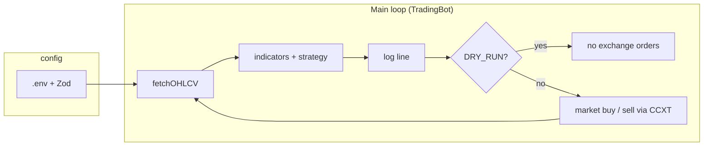

# Binance Spot Trading Bot

A **TypeScript** trading bot for **Binance Spot** (via [CCXT](https://github.com/ccxt/ccxt)). It polls candle data, evaluates **long-only** strategies (SuperTrend by default, EMA+RSI optional), and places **market** orders when you turn off dry-run. Config is **environment-driven** and validated with **Zod** at startup.

**Use cases:** testnet and paper runs (`DRY_RUN`), small live size after you validate behavior, or as a base to extend (risk controls, persistence, your own backtests outside this repo).

---

## Table of contents

1. [Disclaimer](#disclaimer)  
2. [What this bot does](#what-this-bot-does)  
3. [Architecture](#architecture)  
4. [Stack](#stack)  
5. [Strategies](#strategies)  
6. [Execution: orders, balance, bars](#execution-orders-balance-bars)  
7. [Configuration](#configuration)  
8. [Keys and security](#keys-and-security)  
9. [Install and run](#install-and-run)  
10. [Operations and logs](#operations-and-logs)  
11. [Limitations](#limitations)  
12. [Performance and trade history](#performance-and-trade-history)  
13. [Project layout](#project-layout)  
14. [License](#license)  

---

## Disclaimer

- **Not financial, legal, or tax advice.** Spot crypto trading is high risk; you can lose your full position.  
- **Past results do not guarantee future results.** Public strategies (e.g. SuperTrend) are widely used and may be crowded.  
- **You** own API key safety, KYC, taxes, and compliance with laws and [Binance](https://www.binance.com/) terms.  
- This software is provided **as is**, without warranty. **Use at your own risk.**  

Before **live** trading: run on [Binance Spot Testnet](https://testnet.binance.vision/) and keep `DRY_RUN` until you trust the logs and behavior.

---

## What this bot does

| Area | In scope | Not implemented |
|------|----------|-----------------|
| Market | **Binance Spot** (`defaultType: spot`) | Futures, options, margin, other venues |
| Side | **Long** (buy in, sell out) | Short, hedge, pairs |
| Orders | **Market** (CCXT helpers for quote-sized buys) | Limit, TWAP, OCO, etc. |
| Data | `fetchOHLCV` for one `SYMBOL` / `TIMEFRAME` | Order book, funding, on-chain |
| Risk | % of free quote per **buy** | DB VaR, Kelly, drawdown halts, breakers |
| State | In-memory `lastActedOnBarOpen` | Trade DB, full audit trail |
| HA | One process | Multi-region, leader election |

For **live** use you still need monitoring, key hygiene, and position sizes that match your risk tolerance.

---

## Architecture

Tight **poll loop**: `loadMarkets` once, then every `POLL_SEC` fetch OHLCV, compute indicators, get `buy` / `sell` / `hold`, log, and optionally send orders. The **open** candle is **dropped** so signals use **closed** bars only (reduces repainting when polling faster than the timeframe).



- **`src/config.ts`** — one load at startup; bad env → process exits.  
- **`src/strategy.ts`**, **`src/indicators.ts`** — SuperTrend, EMA/RSI.  
- **`src/bot.ts`** — CCXT `binance`, `enableRateLimit: true`, testnet, balance, orders.  

---

## Stack

| Piece | Role |
|-------|------|
| **Node.js ≥ 20** | Runtime |
| **TypeScript** | ESM build to `dist/` |
| **CCXT** | Binance REST (spot) |
| **Zod** | Env parsing |
| **dotenv** | `.env` in dev |
| **tsx** | `npm run dev` |

---

## Strategies

### SuperTrend (`STRATEGY=supertrend`, default)

ATR-based trend following (typical ATR + multiplier bands, trend flips on band breaks). Signals on the **last two closed** bars: **buy** on trend **down → up**, **sell** on **up → down**. Tuning: `ST_ATR_PERIOD`, `ST_MULTIPLIER`.

### EMA + RSI (`STRATEGY=ema_rsi`)

Fast/slow EMA cross on **close**; **buy** on bullish cross if RSI ≤ `RSI_MAX_BUY`; **sell** on bearish cross. Same closed-bar data as above.

**Widely used rules ≠ guaranteed edge.**

---

## Execution: orders, balance, bars

- **Bars:** only **completed** candles feed indicators.  
- **De-dupe:** `lastActedOnBarOpen` blocks repeat buy/sell on the same last closed bar after an action (including dry-run). **Hold** does not set it. If **sell** is signaled but there is no free base, the bar can still be marked so the loop does not spin on warnings.  
- **Buy:** free **quote** × `QUOTE_INVEST_PCT` → market buy (`createMarketOrderWithCost` / `quoteOrderQty` / fallbacks in code).  
- **Sell:** market **all free base** (precision-rounded).  
- **Testnet:** `BINANCE_TESTNET=true` or `1` → CCXT sandbox.  

This is a **simple** executor, not a full OMS: no built-in fill analytics or slippage model.

---

## Configuration

Copy `.env.example` to `.env`. **Do not commit** `.env`.

| Variable | Default / notes |
|----------|-----------------|
| `BINANCE_API_KEY` | `""` — required for private endpoints / live. |
| `BINANCE_SECRET` | `""` |
| `BINANCE_TESTNET` | `true` / `1` → testnet. Else live REST (public OHLCV can work without keys). |
| `DRY_RUN` | Default **on** (anything other than `false` / `0` = no orders). Set `DRY_RUN=false` only when you want real or testnet **orders**. |
| `STRATEGY` | `supertrend` or `ema_rsi` (`ema-rsi`, `emarsi`). |
| `ST_ATR_PERIOD` | `10` |
| `ST_MULTIPLIER` | `3` |
| `SYMBOL` | `BTC/USDT` |
| `TIMEFRAME` | `1h` |
| `EMA_FAST` / `EMA_SLOW` | `12` / `26` — fast must be **&lt;** slow. |
| `RSI_PERIOD` | `14` |
| `RSI_MAX_BUY` | `70` |
| `QUOTE_INVEST_PCT` | `0.1` (10% of free quote per buy) |
| `POLL_SEC` | `60` |

Invalid Zod config or `EMA_FAST >= EMA_SLOW` → exit on startup.

---

## Keys and security

- **Least privilege:** dedicated API key, **no withdrawal** (if the venue allows), **IP allowlist** in production.  
- **Secrets** via env or a secret manager — never in git.  
- **Testnet first:** [testnet.binance.vision](https://testnet.binance.vision/).  
- **Host:** dedicated OS user, lock down `.env` permissions.  
- **This repo** does not encrypt keys on disk.  

---

## Install and run

**Requires:** Node **20+**, `npm`.

```bash
npm install
```

```bash
# Windows
copy .env.example .env
# macOS / Linux
cp .env.example .env
```

For first runs use `DRY_RUN=true` and `BINANCE_TESTNET=true` until behavior matches what you expect.

```bash
npm run dev
```

Production-style (compiled):

```bash
npm run build
npm start
```

Typecheck:

```bash
npm run typecheck
```

**Stop:** Ctrl+C or SIGTERM. There is no automatic cancel-all-orders on exit — use the exchange UI if needed.

---

## Operations and logs

- **Logs:** timestamp (bar time), `close=…`, strategy detail, `BUY` / `SELL` / `HOLD`, and whether action was already taken for that bar. Tick errors are logged; the loop continues.  
- **Monitoring:** ship logs to your stack; alert on repeated `tick error` or process death.  
- **Network:** transient failures show as errors; the bot does not implement custom reconnection beyond CCXT.  
- **What counts as “real” paper:** `DRY_RUN=true` (engine runs, **no** orders) or testnet with small size — **that** is your **operational** record. Anything you export from the exchange (or testnet) is your **authoritative** trade history.  

---

## Limitations

- No stop-loss / take-profit / trailing in the strategy layer.  
- No on-disk position DB — restarts can re-touch the last closed bar on the first tick; be aware around bar boundaries.  
- Fees and slippage not modeled in the bot.  
- Single symbol, single thread.  

---

## Performance and trade history

### How to get **your** real trading history

This repository **does not** store or export fills. **Your** history comes from:

1. **Binance (or testnet):** *Orders* / *Trade History* / account **Export** (CSV) for the date range.  
2. **This bot’s logs:** stdout lines with `BUY`/`SELL`/`HOLD` — redirect to a file and pair timestamps with exchange IDs from the app or API.  
3. **Spreadsheet or journal:** sum **realized** P&L per week or per round-trip; subtract **fees** (Binance schedule applies).  

`DRY_RUN` and testnet give you a **realistic** run of the same code paths without mainnet capital — still not a substitute for legal/tax recordkeeping; use exchange exports for that.

### Example performance journal (illustration only)

The tables below are **synthetic** numbers for **layout** — they are **not** from Binance, not from a linked account, and **not** produced by a built-in backtest in this repo. They show how you might **present** a weekly summary and a small blotter after you paste **your** data.

**Run metadata (fill with your run)**

| Field | Example value (yours will differ) |
|-------|-------------------------------------|
| **Label** | `BTC/USDT` · 1h · SuperTrend · testnet or live |
| **Period** | e.g. Jan–Mar 2026 (your window) |
| **Mode** | `DRY_RUN` / `testnet` / `mainnet` |
| **Fee basis** | Your Binance spot fee tier (illustration uses a flat % only below) |

#### Weekly summary (illustrative)

| Week ending (UTC) | Trades (round-trips) | Avg. notional / leg (USDT) | Gross P&L (USDT) | Fees (USDT) | Net P&L (USDT) | Notes |
|-------------------|----------------------|-----------------------------:|-----------------:|------------:|----------------:|--------|
| 2026-01-04 | 2 | 320 | -4.20 | 0.26 | -4.46 | — |
| 2026-01-11 | 4 | 310 | +6.10 | 0.41 | +5.69 | — |
| 2026-01-18 | 3 | 295 | +2.40 | 0.32 | +2.08 | — |
| 2026-01-25 | 5 | 340 | -8.10 | 0.48 | -8.58 | Choppy week |
| 2026-02-01 | 4 | 300 | +5.20 | 0.40 | +4.80 | — |
| 2026-02-08 | 6 | 315 | +1.50 | 0.45 | +1.05 | — |
| 2026-02-15 | 3 | 330 | -2.10 | 0.33 | -2.43 | — |
| 2026-02-22 | 4 | 305 | +7.80 | 0.44 | +7.36 | — |
| 2026-03-01 | 5 | 325 | -5.60 | 0.45 | -6.05 | — |
| 2026-03-08 | 2 | 310 | +3.10 | 0.29 | +2.81 | — |
| 2026-03-15 | 5 | 300 | -1.20 | 0.42 | -1.62 | — |
| 2026-03-22 | 4 | 318 | +4.00 | 0.41 | +3.59 | — |

**Illustrative net over the sample window (table only):** about **+4.0 USDT** — **not** a performance claim; replace with your exports.

#### Round-trip blotter sample (illustrative)

*Replace with your exchange order or trade IDs.*

| Ref. | Side sequence | Notional (USDT, approx.) | Net after fees (USDT) | Notes |
|------|----------------|--------------------------|------------------------|--------|
| RT-2026-001 | Buy → sell | 300 | -1.80 | Stopped by signal |
| RT-2026-002 | Buy → sell | 300 | +2.10 | — |
| RT-2026-003 | Buy → sell | 320 | +0.40 | — |
| RT-2026-004 | Buy → sell | 310 | -2.20 | — |
| RT-2026-005 | Buy → sell | 315 | +1.60 | — |

**Bottom line:** treat **exchange and tax records** as ground truth. Use this bot’s config and logs to explain *what the automation did*, and use the journal format above (or your own) to track **real** P&L over time.

---

## Project layout

| Path | Role |
|------|------|
| `package.json` | Scripts, deps, Node engine. |
| `tsconfig.json` | TypeScript, ESM, strict. |
| `src/index.ts` | Entry: `loadConfig()`, `TradingBot`, `start()`. |
| `src/config.ts` | `dotenv` + Zod. |
| `src/bot.ts` | CCXT loop, orders. |
| `src/strategy.ts` | Strategy switch. |
| `src/indicators.ts` | EMA, RSI, ATR, SuperTrend. |
| `dist/` | `npm run build` output. |
| `.env.example` | Env template. |

---

## License

This project is provided **as is** without warranty. Add a `LICENSE` file if you need explicit terms. Authors and contributors are **not liable** for trading losses, API issues, or incidents arising from your keys or environment.

For **production** suitability, do your own review, security review, and smallest-size live test after compliance sign-off.
